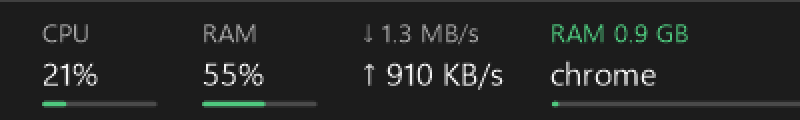

# Taskbar Monitor

A small CPU, memory and network readout that lives inside the Windows 11 taskbar, in
the empty space to the left of the Start button. Next to it sits a panel that names
the heaviest process, cycling through one resource at a time.



It is not a floating window positioned over the taskbar. It is a child window of the
taskbar itself, which is what makes it behave like part of the shell rather than
something sitting on top of it.

## Requirements

| | |
| --- | --- |
| Operating system | Windows 11 (build 22000 or later), or Windows 10 version 1607 or later |
| Architecture | x64 |
| To run a release build | .NET 10 Desktop Runtime, that is `Microsoft.WindowsDesktop.App` 10.0.0 or newer |
| To build from source | .NET 10 SDK |

There are no third party dependencies. The project references no NuGet packages at
all and uses only what ships with the Windows Desktop SDK, so there is nothing to
restore beyond the framework itself.

Everything here was written and verified against Windows 11 Pro 25H2 (build 26200) on
x64, with a single 1920x1200 display at 125% scaling, using .NET SDK 10.0.112. Where
behaviour on other configurations is reasoned about rather than observed, this README
says so rather than implying it was tested.

## Running it

Download the archive from the releases page, extract it anywhere, and run
`TaskbarMonitor.exe`. The widget appears at the left end of the taskbar within a
second or two.

Right click it for a menu with Task Manager, a startup toggle, settings, and exit.
Double click it to open Task Manager.

To start it with Windows, either use the startup toggle in that menu or run:

```
TaskbarMonitor.exe --install
```

which writes a value under `HKCU\Software\Microsoft\Windows\CurrentVersion\Run`.
`--uninstall` removes it again. The Run key is used rather than a Startup folder
shortcut or a scheduled task because the executable is built as a Windows
subsystem application, so nothing flashes a console window on sign in.

Starting before Explorer is ready is fine. If there is no taskbar yet the widget waits
and attaches itself as soon as one appears, which is also how it recovers when
Explorer restarts or crashes.

## What it shows

CPU and memory are shown as percentages with a thin fill bar underneath. Both take a
green, orange, red ramp at the `WarnPercent` and `CriticalPercent` thresholds, and the
number is tinted along with its bar once past the warning level.

Network throughput is shown as separate download and upload rates. It deliberately
stays in the shell's normal text colour, because a busy network link is not a fault
condition and there is no meaningful level to colour it against.

The panel on the right names the heaviest process for one resource at a time and
changes every three seconds:

```
CPU 34%      RAM 7.8 GB     DISK 12 MB/s     GPU 61%
chrome       Code           MsMpEng          dwm
```

Each resource is ranked separately. There is no combined "biggest consumer overall"
number, because 30% of CPU and 8 GB of memory cannot be placed on a single scale and
any score that claims to do so is inventing a comparison. A resource drops out of the
rotation when nothing is doing anything notable with it, so it never sits there
showing `DISK 0 B/s`.

Kernel pseudo processes are skipped: Memory Compression, System, Registry, Secure
System, and the WSL and Hyper-V virtual machine processes. These can genuinely top a
category, Memory Compression in particular often holds several gigabytes, but naming
them tells you nothing you can act on.

### Why there is no per-process network

Windows only exposes per-process network bytes through an ETW kernel session, and
opening one requires elevation. Task Manager can show that column because it runs
elevated. An unelevated widget cannot, so rather than estimate it or quietly show
something else, the rotation covers CPU, memory, disk and GPU and leaves network out.
The machine wide up and down figures are real and come from the adapter counters.

## Configuration

Settings live in `settings.json` next to the executable and are written with defaults
on first run. Edit the file and choose Reload settings from the right click menu.

| Key | Default | Meaning |
| --- | --- | --- |
| `IntervalMs` | 1000 | How often readings are sampled and redrawn |
| `Margin` | 14 | Gap between the widget and the taskbar edge it anchors to, in logical pixels |
| `Anchor` | `Auto` | `Left`, `BeforeTray`, or `Auto` to pick by Windows version |
| `ShowOnAllTaskbars` | true | Also draw on secondary monitor taskbars |
| `GroupGap` | 18 | Space between groups of readings, in logical pixels |
| `ShowCpu`, `ShowRam`, `ShowNetwork` | true | Which readings to include |
| `ShowBars` | true | The thin fill bars under CPU and memory |
| `RamAsGigabytes` | false | Show `9.8/31.7 GB` instead of `54%` |
| `FontScale` | 1.0 | Multiplier on the taskbar's own text size |
| `WarnPercent` | 60 | Orange at or above this |
| `CriticalPercent` | 85 | Red at or above this |
| `ColorizeValues` | true | Tint the number as well as its bar |
| `ShowTopConsumer` | true | The rotating top process panel |
| `TopConsumerWidth` | 108 | Fixed width for that panel, so the widget does not resize as process names change |
| `TopConsumerIntervalMs` | 2000 | How often processes are ranked |
| `TopRotateMs` | 3000 | How long each resource stays on screen |
| `IncludeGpu` | true | Include per-process GPU in the rotation |

## Multiple monitors and display scaling

Windows gives each additional monitor its own taskbar window, of class
`Shell_SecondaryTrayWnd`. The widget looks for those as well as the primary
`Shell_TrayWnd` and attaches a separate instance to each one, so the readings appear on
every taskbar. Set `ShowOnAllTaskbars` to false to keep it on the primary only. Taskbars
that appear or disappear when you plug in or unplug a display are picked up within two
seconds, because the same check that recovers from an Explorer restart also notices new
taskbars.

Each instance measures the DPI of the taskbar it is attached to, so two monitors running
at different scaling factors each get correctly sized text and spacing rather than one
scale being applied everywhere.

This is the part of the project that has not been tested on real hardware. Only one
display was available, so the multiple monitor path is written from the documented
behaviour of the shell rather than confirmed by use. If you run it on a multiple
monitor setup and it misbehaves, that is the first place to look.

Screen size and resolution as such do not matter. Nothing is positioned in absolute
screen coordinates. The widget reads the taskbar's own rectangle and places itself
relative to that, so a larger or higher resolution display simply gives a longer
taskbar with the widget in the same place at the left end. Text is sized from the
taskbar's native 12 pixel shell text scaled by that monitor's DPI, so it matches the
clock at any scaling factor. If you want it larger or smaller than the shell's own
text, `FontScale` multiplies it.

## Windows 10

It should work, and the code paths for it are present, but it has not been run on
Windows 10 and should be treated as unverified.

Nothing in the implementation is specific to the Windows 11 taskbar. `Shell_TrayWnd`
has existed since Windows 95, layered child windows have worked since Windows 8, and
`GetDpiForWindow` needs Windows 10 version 1607, which sets the floor in the
requirements table above. Segoe UI Variable is a Windows 11 font, so on Windows 10 the
text falls back to Segoe UI, which is what that version of the shell uses anyway.

The one real difference is placement. Windows 11 centres the Start button and leaves
the left end of the taskbar empty, which is where the widget goes. Windows 10 puts
Start in the corner, so the left end is occupied and anchoring there would cover it.
For that reason `Anchor` defaults to `Auto`, which anchors to the left end on Windows
11 and just before the notification area on Windows 10, that being where there is
usually room on that layout. Either behaviour can be forced by setting `Anchor` to
`Left` or `BeforeTray` explicitly.

Vertical taskbars, which Windows 10 supports and Windows 11 does not, are not handled.
The layout is a horizontal row of readings and there is nowhere sensible to put it on a
taskbar docked to the left or right edge, so those taskbars are skipped rather than
drawn on badly.

## How it works

Windows 11 removed deskbands, which was the supported way to add a section to the
taskbar, and did not replace them. There is no extensibility point. So the widget
creates a `WS_CHILD` window and parents it to Explorer's taskbar window.

Being an actual child of the taskbar rather than a window floating above it is what
makes the behaviour come out right without any effort. Explorer shows, hides, moves
and clips it along with everything else on the taskbar, so auto hide, fullscreen
applications, resolution changes and display reconfiguration are handled by Windows
rather than by polling for them.

Drawing goes through `UpdateLayeredWindow` with per pixel alpha, so the widget
composites onto the real acrylic and there is no opaque rectangle behind the text.
Colours come from the shell's own settings: light or dark from
`Themes\Personalize\SystemUsesLightTheme`, and the same two tier bright and dim text
arrangement Explorer uses for the clock.

The window has to be lifted above the taskbar's XAML island in the child z-order or
the island paints over it. That is checked before it is changed, because calling
`SetWindowPos` unconditionally every couple of seconds makes Explorer revalidate and
repaint that strip of taskbar for no reason.

An Explorer restart destroys every child of the taskbar, which is the one thing
Windows will not do for us. A hidden top level window listens for the `TaskbarCreated`
broadcast and reattaches, and a two second timer covers the cases that broadcast does
not, including display changes and the widget starting before the shell.

### Where the numbers come from

| Reading | Source |
| --- | --- |
| CPU percent | `GetSystemTimes`, idle against kernel and user deltas |
| Memory | `GlobalMemoryStatusEx` |
| Network | `NetworkInterface.GetIPStatistics` deltas |
| Per-process CPU, memory, disk | a single `NtQuerySystemInformation` call |
| Per-process GPU | PDH, `\GPU Engine(*)\Utilization Percentage` |

There is no use of `PerformanceCounter` anywhere, which avoids both the counter name
localisation problem and its multi second warm up. The GPU path uses
`PdhAddEnglishCounter` for the same reason. Ranking every process from one
`NtQuerySystemInformation` call is considerably cheaper than enumerating
`System.Diagnostics.Process` objects, which opens a handle per process.

Virtual adapters, meaning Hyper-V, WSL2, VPN and loopback, are left out of the network
total. They carry the same bytes as the physical adapter and counting them would
double every number.

Process ranking runs on a background thread. That is not a micro optimisation: a child
of `Shell_TrayWnd` shares an input queue with Explorer, so blocking the UI thread would
stall the taskbar itself.

## Limitations

Reparenting into the taskbar is not a sanctioned API. It is read only, in the sense
that nothing is injected into Explorer and no system files are touched, and it is the
same approach every third party taskbar widget on Windows 11 takes. But it depends on
the shell's window structure, so a future Windows feature update could break it. If
that happens the widget stops drawing and nothing else is affected.

Known gaps, collected in one place:

- Multiple monitor support is implemented but untested on real hardware.
- Windows 10 is supported by design but unverified.
- Vertical taskbars are skipped.
- Per-process network is absent for the reason given above.

## Building

```
build.cmd
```

This stops any running instance, because it holds the executable open, rebuilds into
`bin\`, and starts the new build. Plain `dotnet build src\TaskbarMonitor.csproj` works
too if the widget is not currently running.

## Layout

```
src\
  Native.cs        Win32 interop
  Metrics.cs       machine wide counters
  TopConsumer.cs   per-process ranking
  Theme.cs         shell colours and the level ramp
  Settings.cs      settings.json
  Overlay.cs       the layered child window and its drawing
  Program.cs       lifecycle, reattach watchdog, menu
tools\             diagnostic and capture scripts used while developing
```

## License

MIT. See LICENSE.
